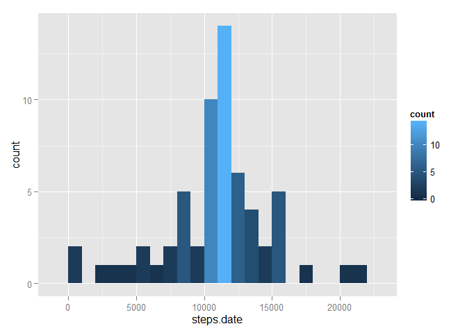

# Reproducible Research: Peer Assessment 1


## Loading and preprocessing the data


```
## 
## Attaching package: 'dplyr'
## 
## The following object is masked from 'package:stats':
## 
##     filter
## 
## The following objects are masked from 'package:base':
## 
##     intersect, setdiff, setequal, union
```

## What is mean total number of steps taken per day?


```r
df <- tbl_df(rawdata)
rm("rawdata")

## Steps per Day
sdf <- df %>%
        group_by(date) %>%
        summarize(sum(steps))

names(sdf) <- c("date", "steps.date")

##  Histogram of the total number of steps taken each day

m <- ggplot(sdf, aes(x=steps.date))
m + geom_histogram(binwidth = 1000, aes(fill = ..count..))
```

 

```r
## Mean of Steps per Day

as.numeric(summarize(sdf, mean(steps.date, na.rm=TRUE)))
```

```
## [1] 10766.19
```

## What is the average daily activity pattern?


```r
## Make a time series plot (i.e. type = "l") of the 5-minute interval (x-axis) and the average number of steps taken, averaged across all days (y-axis)

## Steps per Interval
idf <- df %>%
        group_by(interval) %>%
        summarize(mean(steps,na.rm=TRUE))

names(idf) <- c("interval","average.steps.interval")

m <- ggplot(idf, aes(interval, average.steps.interval))
m + geom_line()
```

 

```r
## Which 5-minute interval, on average across all the days in the dataset, contains the maximum number of steps?

arrange(idf,desc(average.steps.interval))
```

```
## Source: local data frame [288 x 2]
## 
##    interval average.steps.interval
## 1       835               206.1698
## 2       840               195.9245
## 3       850               183.3962
## 4       845               179.5660
## 5       830               177.3019
## 6       820               171.1509
## 7       855               167.0189
## 8       815               157.5283
## 9       825               155.3962
## 10      900               143.4528
## ..      ...                    ...
```

```r
## This code generates a descending list of the intervals with most steps in average.
```


## Imputing missing values


```r
## Calculate and report the total number of missing values in the dataset 

sum(is.na(df$steps))
```

```
## [1] 2304
```

```r
## Devise a strategy for filling in all of the missing values in the dataset. I will use the average for the interval we are dealing with.

## Create a new dataset that is equal to the original dataset but with the missing data filled in.

ndf <- df
intervals <- nrow(idf)
for (i in 1:nrow(ndf)) {
        if (is.na(ndf[i,1])) 
                ndf[i,1] <- idf[(as.numeric(ndf[i,3])/5)%%intervals+1, 2]
}

## Steps per Day
sndf <- ndf %>%
        group_by(date) %>%
        summarize(sum(steps,na.rm=TRUE))

names(sndf) <- c("date", "steps.date")

##  Histogram of the total number of steps taken each day

m <- ggplot(sndf, aes(x=steps.date))
m + geom_histogram(binwidth = 1000, aes(fill = ..count..))
```

 

```r
## Mean of Steps per Day

as.numeric(summarize(sndf, mean(steps.date)))
```

```
## [1] 10797.29
```

```r
## Median

as.numeric(summarize(sndf, median(steps.date)))
```

```
## [1] 11003.32
```

```r
##Do these values differ from the estimates from the first part of the assignment? What is the impact of imputing missing data on the estimates of the total daily number of steps?

## It lowers the mean of steps taken daily by more than 5% and splits the distribution to make it broader having then dispersed the data.
```


## Are there differences in activity patterns between weekdays and weekends?


```r
## Create a new factor variable in the dataset with two levels - "weekday" and "weekend" indicating whether a given date is a weekday or weekend day.

xndf <- ndf
weekend<-c("Saturday","Sunday")
xndf <- mutate(xndf, is.weekday = ifelse( weekdays(as.Date(date)) %in% weekend, "weekend","weekday"))

ggplot(xndf, aes(interval, steps, na.rm = TRUE)) + geom_line()+facet_grid(is.weekday ~ .)
```

 
